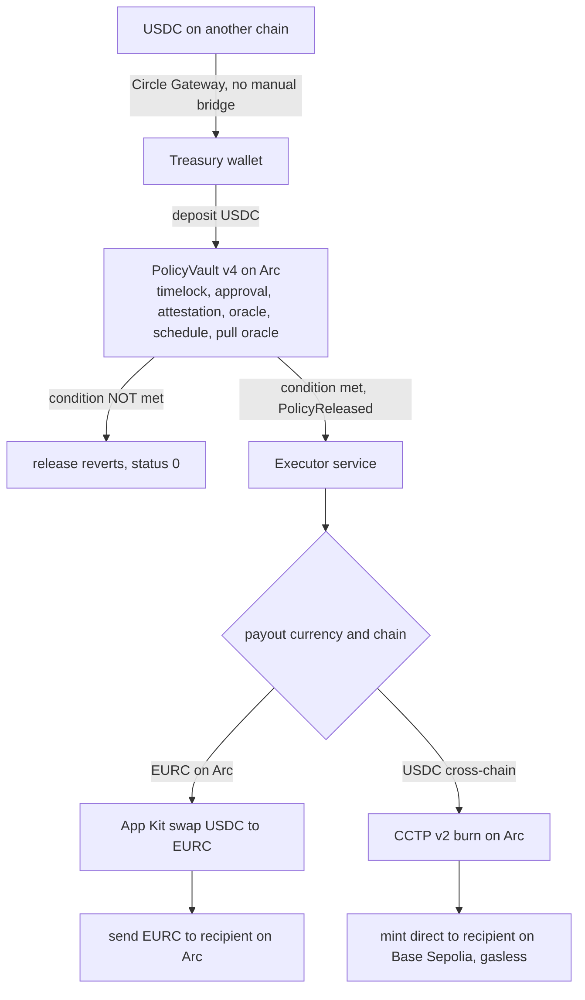

# Covenant

Programmable treasury settlement on Arc. Lock USDC in an onchain vault, attach a rule for who gets paid, how much, in which currency, and on which chain, and the payment settles itself the moment the rule is met. Every step is verifiable onchain.

Built for the Circle brief on stablecoin-native DeFi on Arc. Testnet only.

## What it is

A treasury holder deposits USDC into a vault and creates a policy: pay recipient R an amount A, in currency C, on chain D, but only when condition X is met. The moment the condition is satisfied, settlement runs on its own. It converts the currency if it needs to, moves the funds across chains with CCTP, and pays the recipient. Nobody signs anything after the trigger.

The split that makes this safe: the contract decides whether the money moves, and enforces the condition onchain. The off-chain service only decides how the money routes. If the condition is not met, release reverts on Arc, and anyone can check that it did.

## How it works



- **PolicyVault** (Solidity, Arc) holds the USDC and enforces the release condition. It supports six release conditions: a timelock, an N-of-M approval, an attester's EIP-712 signature, a price feed crossing a threshold, a schedule, and a signed price proof verified at release. Release reverts if the condition is not met.
- **Executor** (TypeScript) watches for the `PolicyReleased` event and routes the settlement. It never decides whether funds move, only how they get to the recipient. Settlement state is written before any funds move, so a restart never pays twice.
- **Wallets** are Circle developer-controlled wallets for the treasury, executor, and recipient roles, behind one interface so a later move to user-controlled wallets touches no settlement logic.

## Why this needs Arc

This is treasury logic that only stays simple when the stablecoin is the native asset.

- **USDC is native gas.** Deploying the current vault (v4, six condition types) costs 0.0797 USDC in gas; the first canary vault cost 0.0294. Priced in dollars, with no exposure to a separate volatile gas token. Full per-deployment history in [docs/RESULTS.md](docs/RESULTS.md).
- **Sub-second finality.** Settlement completes in seconds, not the days a conventional cross-border payment takes.
- **Native cross-chain USDC.** CCTP v2 burns and mints the real asset. No wrapped tokens and no third-party bridge.
- **Gasless recipient.** Circle's forwarder submits the mint, so the payee needs no gas token on the destination chain to be paid.

## Circle products used

| Product | Where it is used |
| --- | --- |
| USDC on Arc | Native gas token and the settlement asset. Amounts, fees, and deploy cost are all in dollars. |
| Circle Wallets | Developer-controlled treasury, executor, and recipient wallets, behind one interface. |
| App Kit | Swap for the FX leg, send for the payout, run server-side with idempotent settlement state. |
| CCTP v2 | Native cross-chain USDC by burn and mint, with a forwarder so the recipient needs no gas. |
| Gateway | Fund an Arc policy from a unified USDC balance sourced on another chain, with no manual bridge. |

## Proof

Everything is proven on live testnet. Full transaction hashes and explorer links are in [docs/RESULTS.md](docs/RESULTS.md), and [docs/WALKTHROUGH.md](docs/WALKTHROUGH.md) is a ten-minute tour of the two strongest proofs.

All figures below are from the v4 re-proof pass, run on 2026-08-09.

| Result | Value |
| --- | --- |
| FX settlement on Arc, release to paid | 11.8 seconds |
| Cross-chain settlement, Arc to Base Sepolia | 31.5 seconds |
| Attestation settlement, signed release to paid | 3.7 seconds |
| Oracle settlement, depeg-protection release to paid | 3.9 seconds |
| Pull oracle, price verified and released | one transaction |
| Pull oracle, uncertain price refused | 8.01 bps spread against a 4 bps bound |
| Recurring payroll | 3 periods, each settled independently |
| Fund an Arc policy from USDC on Base Sepolia | via Gateway, no manual bridge |
| PolicyVault v4 deployment cost | 0.0797 USDC (v1 was 0.0294; cost grows with each condition type) |
| Recipient paid on Base Sepolia | while holding zero ETH |
| Condition unmet | release reverts onchain, status 0 |
| Automated tests | 337, across contract and executor |

Deployed PolicyVault: [`0x3b507607bA48A65587a9a6136c36cd2f1132d498`](https://testnet.arcscan.app/address/0x3b507607bA48A65587a9a6136c36cd2f1132d498) on Arc Testnet (chain id 5042002), carrying all six condition types. Two superseded deployments remain readable for their proofs: v3 at [`0xDC0040eB02c438D59838A6f178e38184eACf7300`](https://testnet.arcscan.app/address/0xDC0040eB02c438D59838A6f178e38184eACf7300) and v2 at [`0xB702404EA947aec698323Cd42989CA6168f209D1`](https://testnet.arcscan.app/address/0xB702404EA947aec698323Cd42989CA6168f209D1). Each is a separate address because the vault is immutable. Full hashes, per-deployment, are in [docs/RESULTS.md](docs/RESULTS.md), which also records the known defects found so far.

## Repository layout

```
contracts/   Foundry package: PolicyVault, tests, deploy script
executor/    TypeScript service: event watcher, settlement engine, Circle integration,
             the read model, the read-only monitor, and the gated write API
app/         React operator app: create, fund, approve, and release policies through the API
site/        Static landing page
docs/        RESULTS.md, onchain proof for every claim
scripts/     Repo checks (test-count derivation)
```

Code comments cite internal working documents under `docs/` (`VERIFICATIONS.md`, `DECISIONS.md`, and `specs/`): the records of what was verified against Circle and Arc documentation, why each architectural call was made, and the Phase 2 design. Those are not part of this repository. The findings that matter to the code are restated in the comments themselves, so nothing here depends on reading them.

## Running it

Prerequisites: Node 20 or newer, Foundry, and a filled `.env` (copy `.env.example`). Testnet only.

```bash
git submodule update --init # OpenZeppelin, required before the contracts will build
npm install                 # root and the executor workspace
npm --prefix app install    # the app is a separate package with its own lockfile
npm test                    # the Foundry contract suite and the executor suite

npm run wallets:write       # create the Circle developer-controlled wallets
npm run deploy              # deploy PolicyVault to Arc testnet
npm run canary              # stage and settle the FX and cross-chain archetypes
npm run demo:attestation    # release a policy on a signed attestation, end to end
npm run failure-path        # demonstrate the onchain revert when a condition is unmet
npm run dashboard           # read-only monitor: policies, settlement receipts, live depeg panel
```

The operator app, which creates, funds, approves, and releases policies through a gated API:

```bash
npm run api                 # the write API. Needs OPERATOR_SECRET; see .env.example
npm --prefix app run dev    # the operator app, proxying /api to the API above
npm --prefix app run build  # production bundle, gated on the bundle secret check
```

The API refuses to start in a deployed environment without an operator secret and a pinned CORS origin. For a local run set `COVENANT_ENV=dev`. The app talks only to the API: it holds no keys and no provider, and `npm --prefix app run build` fails if any secret material reaches the bundle.

Repo checks:

```bash
npm run typecheck           # both TypeScript packages
npm run test:count          # derive the test count and check the README against it
```

Fund the treasury and executor wallets from the Circle faucet at faucet.circle.com on Arc Testnet before running the canary. USDC is gas on Arc, so the executor needs a working balance on top of the settlement amounts.

## Deploying

Two halves with different requirements, and the split is not cosmetic.

| Piece | What it is | Where it can run |
| --- | --- | --- |
| landing page and operator app | one static bundle, page at `/` and app at `/app` | any static host |
| the write API | persistent Node process | a host that keeps a process alive |
| the monitor | persistent Node process, read-only | same |

`npm run build:web` produces the static half into `dist/`: the landing page at the root and the app under `/app`. They ship together on one host so the landing page links the app with a relative path. That is presentation only; the app's connection to the write API is cross-origin either way, because the API is not on that host.

The build refuses to assemble if the app bundle was compiled without the `/app/` base, since its assets would otherwise resolve to the root and return the landing page's HTML instead of JavaScript.

**The API must not run on serverless functions.** Two protections depend on state held in the process. Idempotency reserves an in-flight key so simultaneous duplicate writes collapse into one execution; login rate limiting counts attempts against the single operator secret. Split across instances, both silently stop working: two concurrent funds land on separate instances and both execute, and the brute-force ceiling becomes per-instance rather than global. Nothing errors. Run the API where one process handles all of it, or move both to shared storage first.

### Splitting the app and the API across origins

The static bundle and the API on different hosts is a cross-site pair, and three settings have to agree:

```bash
# on the app build
VITE_API_BASE=https://api.example.com   # absolute, or requests go to the app's own origin

# on the API
COVENANT_CORS_ORIGIN=https://app.example.com   # the app's exact origin, never a wildcard
OPERATOR_SECRET=...                            # required; the API refuses to start without it
```

The session cookie switches to `SameSite=None; Secure` automatically when a cross-origin deployment is detected, because a `SameSite=Strict` cookie is never sent cross-site and every write would fail as unauthenticated with nothing in the logs to explain it. That relaxation gives up the browser's own CSRF protection, so write routes then require an `Origin` header matching `COVENANT_CORS_ORIGIN`. Both changes are derived from one flag so they cannot drift apart.

If the app and API sit behind one origin through a proxy, set `COVENANT_SAME_ORIGIN=true` to keep the stricter cookie.

`APP_URL` at the top of the script block in `site/index.html` points at the app. It is `/app`, matching the assembled layout. Set it to `""` to hide the button; a landing page should show no link rather than a dead one.

### Vercel

`vercel.json` sets the build command and output directory. Keep the project's root directory at the repository root: the config and the assembly step both live there, and neither `site/` nor `app/` can produce the combined output on its own. Leave the build and output fields blank in the dashboard, since the file already sets them.

The one rewrite sends unmatched `/app/*` paths to the app's entry point. The app is a single page with no server routes, and static files under `/app` are served directly, so only paths with no file behind them fall through. Vercel's schema rejects unknown keys in that object, so the explanation lives here rather than beside it.

Set `VITE_API_BASE` as a build environment variable pointing at the deployed API, with no trailing slash, or the app will request `/api` from its own origin and find nothing there. It is baked into the bundle at build time, so changing it needs a redeploy.

### Railway

`railway.json` configures the API service: `npm ci` to build, `npm run api` to start, health check on `/api/health`. The health route touches nothing, so a probe running every few seconds costs no chain reads.

The process binds `PORT` if the platform sets one, falling back to `API_PORT` and then 4320.

Environment variables to set on the service: everything in `.env.example` that the API path needs, which is the Arc and Base Sepolia RPC URLs, the vault and token addresses, the Pyth adapter and feed id, the Circle API key and entity secret, the wallet ids, `DEPLOYER_PRIVATE_KEY`, plus `OPERATOR_SECRET` and `COVENANT_CORS_ORIGIN` pinned to the app's origin. Leave `COVENANT_ENV` unset: the API refuses to start in deployed mode without a secret and a pinned origin, which is the point.

**Mount a volume at `executor/.state` if you want settlement receipts to survive a redeploy.** Container filesystems are ephemeral. The API only reads that directory, so losing it costs the Settlements tab its history and nothing else. It becomes load-bearing the moment anything that *writes* settlements runs here, because that store is the record that stops a replayed event paying twice. Nothing in this repo's start scripts does today.

The monitor is a second service from the same repo with `npm run dashboard` as its start command. It is read-only, holds no keys, and mounts no write routes, which makes it the safe thing to link publicly.

## Status

All six condition types settle end to end on PolicyVault v4, and every failure path is proven onchain with its revert reason decoded, not just its status.

**Conditions.** A timelock releases after a timestamp. An N-of-M approval releases once the named approvers sign. An attestation releases on a named attester's EIP-712 signature, bound to the policy and the contract so it cannot be replayed. A schedule releases period by period, for payroll or for sweeping a balance above a buffer, with a `maxCatchUp` bound that holds a long-overdue period for owner approval rather than auto-paying it.

**Oracle, two paths, one guarantee each.** Arc testnet publishes no Chainlink push feeds, but Pyth is deployed on Arc and reachable with no credentials. The pushed-feed path reads Pyth through its official PythAggregatorV3 adapter: the price must be refreshed before release, and the interface carries no confidence interval, so that path cannot check one. The pull path takes a signed price proof through a pluggable adapter, verifies it and releases in a single transaction, and rejects a price whose confidence interval is wider than the policy allows. New policies default to the pull path. Both fail closed.

**Gateway** funds an Arc policy from a unified USDC balance sourced on another chain with no manual bridge, proven end to end from Base Sepolia. The vault is untouched; Gateway sits upstream on the funding side.

**Surfaces.** An operator app creates, funds, approves, and releases policies through a gated API that holds the only credentials. A read-only monitor (`npm run dashboard`) shows every policy across all three deployments, a settlement receipt per transaction with its measured custody gap, and a live Pyth depeg panel.

The vault is immutable, so v4 is the third address. v2 and v3 remain readable for their proofs and are never written to. [docs/RESULTS.md](docs/RESULTS.md) records every deployment's proofs separately, and records the known defects found so far, including one still open. Testnet only.
