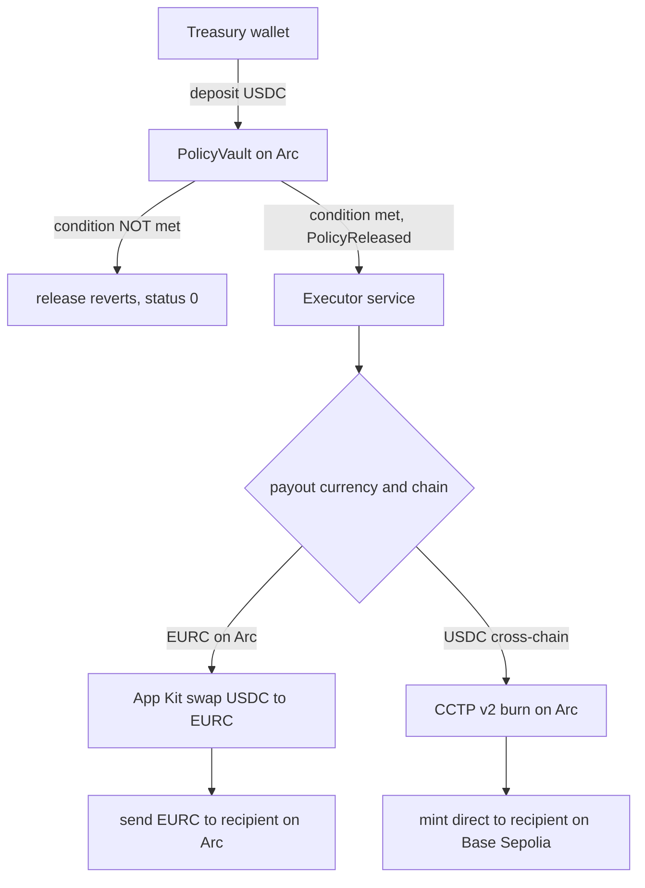

# Covenant

Programmable treasury settlement on Arc. Lock USDC in an onchain vault, attach a rule for who gets paid, how much, in which currency, and on which chain, and the payment settles itself the moment the rule is met. Every step is verifiable onchain.

Built for the Circle brief on stablecoin-native DeFi on Arc. Testnet only.

## What it is

A treasury holder deposits USDC into a vault and creates a policy: pay recipient R an amount A, in currency C, on chain D, but only when condition X is met. The moment the condition is satisfied, settlement runs on its own. It converts the currency if it needs to, moves the funds across chains with CCTP, and pays the recipient. Nobody signs anything after the trigger.

The split that makes this safe: the contract decides whether the money moves, and enforces the condition onchain. The off-chain service only decides how the money routes. If the condition is not met, release reverts on Arc, and anyone can check that it did.

## How it works



- **PolicyVault** (Solidity, Arc) holds the USDC and enforces the release condition. It supports four release conditions: a timelock, an N-of-M approval, an attester's EIP-712 signature, and a Pyth price feed crossing a threshold. Release reverts if the condition is not met.
- **Executor** (TypeScript) watches for the `PolicyReleased` event and routes the settlement. It never decides whether funds move, only how they get to the recipient. Settlement state is written before any funds move, so a restart never pays twice.
- **Wallets** are Circle developer-controlled wallets for the treasury, executor, and recipient roles, behind one interface so a later move to user-controlled wallets touches no settlement logic.

## Why this needs Arc

This is treasury logic that only stays simple when the stablecoin is the native asset.

- **USDC is native gas.** The vault deploys for about seven cents, priced in dollars, with no exposure to a separate volatile gas token.
- **Sub-second finality.** Settlement completes in seconds, not the days a conventional cross-border payment takes.
- **Native cross-chain USDC.** CCTP v2 burns and mints the real asset. No wrapped tokens and no third-party bridge.
- **Gasless recipient.** Circle's forwarder submits the mint, so the payee needs no gas token on the destination chain to be paid.

## Circle products used

| Product | Where it is used |
| --- | --- |
| USDC on Arc | Native gas token and the settlement asset. Amounts, fees, and deploy cost are all in dollars. |
| Circle Wallets | Developer-controlled treasury, executor, and recipient wallets, behind one interface. |
| App Kit | Swap for the FX leg, send for the payout, run server-side with idempotent settlement state. |
| CCTP v2 | Native cross-chain USDC by burn and mint, with a forwarder so the recipient needs no gas. |

## Proof

Everything is proven on live testnet. Full transaction hashes and explorer links are in [docs/RESULTS.md](docs/RESULTS.md).

| Result | Value |
| --- | --- |
| FX settlement on Arc, release to paid | 16.6 seconds |
| Cross-chain settlement, Arc to Base Sepolia | 28.8 seconds |
| Attestation settlement, signed release to paid | 6.8 seconds |
| Oracle settlement, depeg-protection release to paid | 9.0 seconds |
| PolicyVault deployment cost | 0.0592 USDC |
| Recipient paid on Base Sepolia | while holding zero ETH |
| Condition unmet | release reverts onchain, status 0 |
| Automated tests | 178, across contract and executor |

Deployed PolicyVault: [`0xB702404EA947aec698323Cd42989CA6168f209D1`](https://testnet.arcscan.app/address/0xB702404EA947aec698323Cd42989CA6168f209D1) on Arc Testnet (chain id 5042002). Every proof in [docs/RESULTS.md](docs/RESULTS.md) is on this one contract.

## Repository layout

```
contracts/   Foundry package: PolicyVault, tests, deploy script
executor/    TypeScript service: event watcher, settlement engine, Circle integration
docs/        RESULTS.md, onchain proof for every claim
```

Code comments cite internal working documents under `docs/` (`VERIFICATIONS.md`, `DECISIONS.md`, and `specs/`): the records of what was verified against Circle and Arc documentation, why each architectural call was made, and the Phase 2 design. Those are not part of this repository. The findings that matter to the code are restated in the comments themselves, so nothing here depends on reading them.

## Running it

Prerequisites: Node 20 or newer, Foundry, and a filled `.env` (copy `.env.example`). Testnet only.

```bash
git submodule update --init # OpenZeppelin, required before the contracts will build
npm install                 # install executor dependencies
npm test                    # 178 tests: Foundry contract suite and executor suite

npm run wallets:write       # create the Circle developer-controlled wallets
npm run deploy              # deploy PolicyVault to Arc testnet
npm run canary              # stage and settle the FX and cross-chain archetypes
npm run demo:attestation    # release a policy on a signed attestation, end to end
npm run failure-path        # demonstrate the onchain revert when a condition is unmet
```

Fund the treasury and executor wallets from the Circle faucet at faucet.circle.com on Arc Testnet before running the canary. USDC is gas on Arc, so the executor needs a working balance on top of the settlement amounts.

## Status

Phase 1, the settlement canary, is complete: both payment archetypes settle end to end onchain, the failure path is proven, and the recipient is never short-changed.

Phase 2 has added two condition types, both proven onchain. Attestation, where an attester's EIP-712 signature releases a policy, settles in 6.8 seconds. Oracle, where a price feed crossing a threshold releases a policy, is demoed as a USDC/USD depeg-protection policy against a live Pyth feed. Arc testnet does not publish Chainlink push Data Feeds, but Pyth is a pull oracle deployed on Arc and reachable with no credentials, and its official PythAggregatorV3 adapter exposes a feed through the same AggregatorV3Interface the condition already reads, so the condition runs against live Pyth data with no change to the vault. v1 checks the price against the threshold through that adapter; confidence-interval rejection is designed and lands with the generic adapter. The system runs on testnet only.
