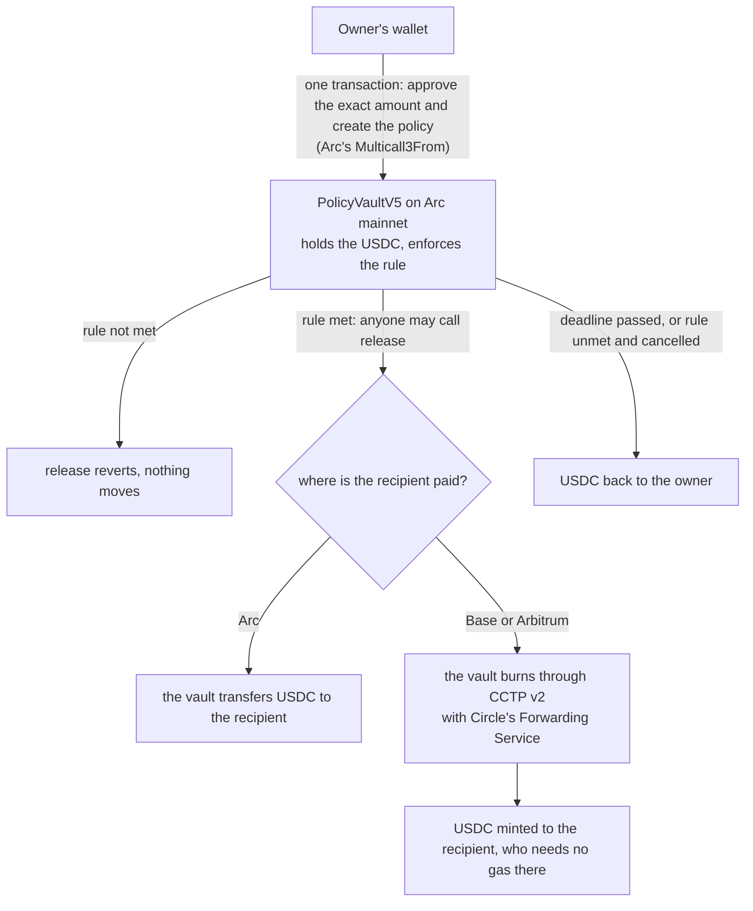

# Covenant

Conditional USDC payments on Arc. Put USDC into a policy from your own wallet, attach a rule for when it may be paid, and the vault pays the recipient itself the moment the rule is met: on Arc, or on Base or Arbitrum through Circle's CCTP. Nobody else can move the money. If the rule is never met, you take it back.

> **Live on Arc mainnet as an unaudited beta.** The vault can hold at most **100 USDC in total** across everyone, so use small amounts. It has not been audited yet.

| | |
| --- | --- |
| **App** | [covenant-mainnet.vercel.app](https://covenant-mainnet.vercel.app) |
| **Network** | Arc mainnet, chain id 5042 |
| **Vault** | [`0x6C2F006D6788883Cc6520DB80905079f2BBDB3f7`](https://explorer.arc.io/address/0x6C2F006D6788883Cc6520DB80905079f2BBDB3f7) (PolicyVaultV5) |
| **Source** | verified on Sourcify, exact match: [repo.sourcify.dev/5042/0x6C2F…B3f7](https://repo.sourcify.dev/5042/0x6C2F006D6788883Cc6520DB80905079f2BBDB3f7) |
| **Guardian** | [`0x75e204AfA5f390490f2d5021c92C1B5d38a9D52a`](https://explorer.arc.io/address/0x75e204AfA5f390490f2d5021c92C1B5d38a9D52a), a 2-of-3 Safe |
| **Funds cap** | 100 USDC across all policies, raise-only |
| **Pays out on** | Arc, Base, Arbitrum |

To use it you need a browser wallet (MetaMask, Rabby and the like) and some USDC on Arc mainnet. USDC is also Arc's gas, so there is no other token to hold. Brave's Shields block Arc's public RPCs: allow the site, or connect your wallet and the app reads through it.

## What a policy can do

A policy is one promise: pay this recipient this much, on this chain, when this condition holds, and not after this deadline.

| Condition | Pays when | In the app |
| --- | --- | --- |
| Timelock | a moment has passed | yes |
| Approval | N of the named approvers have approved | yes |
| Attestation | a named attester has signed the policy's EIP-712 statement | yes |
| Payroll | every interval, a fixed amount, for a fixed or open-ended number of periods | yes |
| Sweep | every interval, everything held above a buffer | yes |
| Price | a Chainlink price feed is above or below a threshold | contract only |
| Signed price | a signed price proof, verified at release | contract only; no provider on Arc mainnet yet |

Before the deadline the owner can cancel a policy whose condition is not met, and get everything back. After the deadline the owner can reclaim whatever was not paid. A stopped payroll still pays the periods already owed. Deadlines can only move later, which only ever helps the recipient.

## How it works


```mermaid
flowchart TB
    O[Owner's wallet] -->|"one transaction: approve the exact amount and create the policy<br/>(Arc's Multicall3From)"| V["PolicyVaultV5 on Arc mainnet<br/>holds the USDC, enforces the rule"]
    V -->|rule not met| X[release reverts, nothing moves]
    V -->|rule met: anyone may call release| P{where is the recipient paid?}
    P -->|Arc| A[the vault transfers USDC to the recipient]
    P -->|Base or Arbitrum| C["the vault burns through CCTP v2<br/>with Circle's Forwarding Service"]
    C --> M[USDC minted to the recipient, who needs no gas there]
    V -->|deadline passed, or rule unmet and cancelled| R[USDC back to the owner]
```

- **Non-custodial.** Each policy belongs to the wallet that funded it. There is no admin key, no upgrade path and no operator holding funds: the contract is immutable, and the only places the money can ever go are the recipient and the owner.
- **The vault pays directly.** On Arc, the payout is a transfer in the release transaction itself. Cross-chain, the vault burns with CCTP v2 and Circle's Forwarding Service mints to the recipient, who needs no gas on the destination chain. The cross-chain fee is fixed when the policy is created and paid by the owner, never taken from the recipient's amount.
- **Release is permissionless.** The rule is the only gate, so anyone can release a policy that is due: the recipient, the owner, or a keeper. Covenant's keeper does it automatically; on mainnet it is not running yet, so a due policy is released by pressing Release.
- **One transaction to fund.** The app approves exactly the amount needed and creates the policy in a single transaction through Arc's own Multicall3From, so no allowance is left behind. Every action is simulated first, so a refusal shows the vault's own reason before the wallet asks for anything.
- **The vault address is built into the app,** not fetched from a server, so nothing between you and Arc can point your money somewhere else.

### The guardian

The guardian is a 2-of-3 Safe. It can pause releases for up to 7 days, then must wait 7 days after the pause ends before pausing again, and every deadline moves out by the time spent paused, so a pause can never turn a recipient's payment into an owner's refund. Owners can still cancel unmet policies and reclaim during a pause. The guardian can raise the funds cap but never lower it, and can hand the role on or give it up. It can never move, redirect or freeze anyone's money.

## Status and limits

- **Unaudited.** The contract has 52 tests of its own, mutation-tested, and was exercised end to end on Arc testnet from ordinary browser wallets before going to mainnet. An audit comes next; until then, the 100 USDC cap bounds what is at risk.
- **Arc runs Ethereum's EVM with differences** (USDC as gas, a USDC blocklist enforced at runtime, a 20 gwei minimum fee). If a recipient is blocklisted by USDC, payments to them revert and the owner reclaims after the deadline. The app and keeper always offer at least Arc's minimum fee.
- **Price conditions** are in the contract but not yet in the app. Pyth, the signed-price provider used on testnet, is not deployed on Arc mainnet.

## Proof on mainnet

Read from the chain and from Circle's API, not copied from a terminal.

| Step | Transaction |
| --- | --- |
| Vault deployed, block 23706907, cost 0.1023 USDC | [`0xcd2a9a43…`](https://explorer.arc.io/tx/0xcd2a9a43d09fdd8cc50d1294f85d870fbce5aa8eed57d0a2bd01c900e323521f) |
| Policy 0 created and funded in one transaction | [`0x93c9a2e2…`](https://explorer.arc.io/tx/0x93c9a2e299d4c6ab37684d21f21dbc2a31af8339c216a28e71394c434be61c82) |
| Policy 0 released: the vault paid 0.10 USDC to the recipient on Arc | [`0x6242536b…`](https://explorer.arc.io/tx/0x6242536b4b1be14621936bdc5d96c1af573f8305774dd2230c7d4f097dfae37b) |
| Policy 1 created and funded in one transaction | [`0x6405787e…`](https://explorer.arc.io/tx/0x6405787ef5a67948809ae9e19218cc0dc4b2c0448c971dac2b5a1c55c4e0e256) |
| Policy 1 released: the vault burned through CCTP v2 for Base | [`0xd691b510…`](https://explorer.arc.io/tx/0xd691b51026dbd5d6c72f64348556413b0ce826933d7cca9a15ab7cd4ba6c7009) |
| 0.10 USDC minted to the recipient on Base, 8 seconds later, while it held no ETH | [`0xc8fe7f99…`](https://basescan.org/tx/0xc8fe7f99a509f50a827604d19f3ca252dfb283fab58b9bc52fdc5f896b2b1be7) |

| Quality check | Result |
| --- | --- |
| Automated tests | 497, across contract and executor |
| Every transaction hash cited in this repository | resolved against its chain in CI (`npm run verify:hashes`) |
| App bundles | built in CI and checked for secret material |

## Testnet history

Everything in this section ran on **Arc testnet** (chain id 5042002) and **Base Sepolia**, with test USDC. None of it is mainnet.

Covenant began as an operator-run treasury engine: an operator funded policies from a treasury wallet, and an off-chain executor paid recipients after the vault released, swapping to EURC with App Kit or bridging with CCTP v2. That model was proven end to end across three testnet vaults, then replaced by v5, because funding other people's payments from one operator's wallet makes the operator their custodian.

| Deployment | Network | Address | What it carries |
| --- | --- | --- | --- |
| v5 | Arc testnet | [`0x87A204d4eDbE715b00eA05a2Ad860f40b710c890`](https://testnet.arcscan.app/address/0x87A204d4eDbE715b00eA05a2Ad860f40b710c890) | the same contract as mainnet, used for its re-proof |
| v4 | Arc testnet | [`0x3b507607bA48A65587a9a6136c36cd2f1132d498`](https://testnet.arcscan.app/address/0x3b507607bA48A65587a9a6136c36cd2f1132d498) | operator model, six conditions, pull oracle |
| v3 | Arc testnet | [`0xDC0040eB02c438D59838A6f178e38184eACf7300`](https://testnet.arcscan.app/address/0xDC0040eB02c438D59838A6f178e38184eACf7300) | superseded, read-only |
| v2 | Arc testnet | [`0xB702404EA947aec698323Cd42989CA6168f209D1`](https://testnet.arcscan.app/address/0xB702404EA947aec698323Cd42989CA6168f209D1) | superseded, read-only |

From the v4 testnet re-proof, run on 2026-08-09:

| Result on testnet | Value |
| --- | --- |
| FX settlement on Arc, release to paid | 11.8 seconds |
| Cross-chain settlement, Arc to Base Sepolia | 31.5 seconds |
| Attestation settlement, signed release to paid | 3.7 seconds |
| Pull oracle: an uncertain price refused | 8.01 bps spread against a 4 bps bound |
| Funding from USDC on Base Sepolia | via Circle Gateway, no manual bridge |
| Condition unmet | release reverts onchain |

Every testnet hash, per deployment, and the known defects found along the way are in [docs/RESULTS.md](docs/RESULTS.md).

## Circle and Arc pieces used

| Piece | Where |
| --- | --- |
| USDC on Arc | the settlement asset and the gas |
| CCTP v2 with the Forwarding Service | cross-chain payouts made by the vault itself, minted gas-free to the recipient |
| Circle's fee API | the cross-chain fee fixed on each policy |
| Arc's Multicall3From | approve and create in one transaction, as the user |
| Chainlink on Arc | price conditions (contract) |
| viem's Arc chains | network settings in the app |
| Safe on Arc | the guardian multisig |
| Circle Wallets, App Kit, Gateway | the testnet operator model (see Testnet history) |

## Repository

```
contracts/   Foundry: PolicyVaultV5 (and the earlier vaults), tests, deploy scripts, broadcast records
executor/    TypeScript: the v5 keeper and monitor, and the testnet operator API and settlement engine
app/         React app: the mainnet build (npm run build:mainnet) and the testnet build
site/        Landing page for the testnet site
docs/        RESULTS.md (onchain proof), OPERATIONS.md (running and deploying everything)
scripts/     Repo checks: test count, hash verification, site assembly
```

Run the checks:

```bash
git submodule update --init    # OpenZeppelin, before the contracts build
npm install && npm --prefix app install
npm test                       # contract and executor suites
npm run typecheck
npm --prefix app run dev:mainnet   # the mainnet app, locally
```

Running the keeper, the monitor, the testnet operator API, and deploying the sites: [docs/OPERATIONS.md](docs/OPERATIONS.md).
